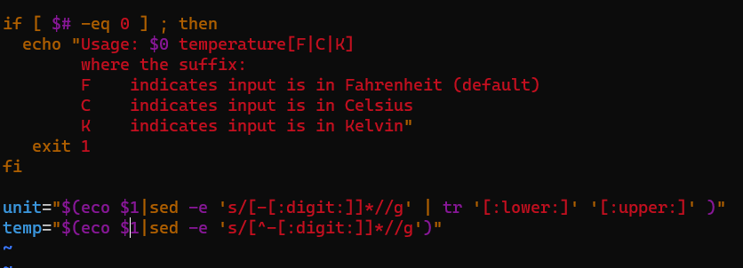
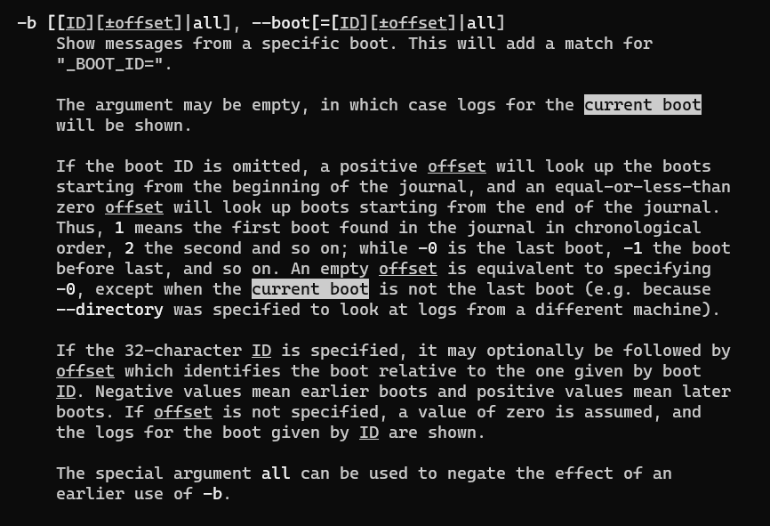
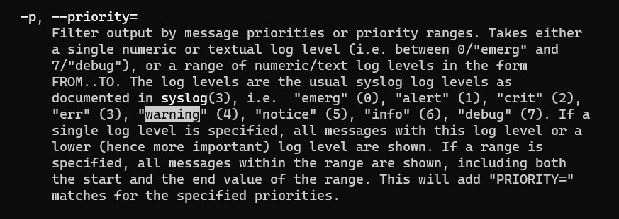
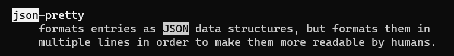
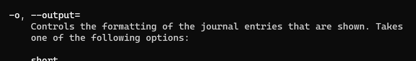
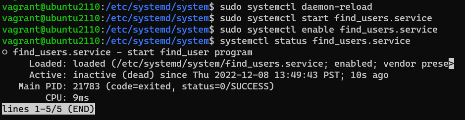
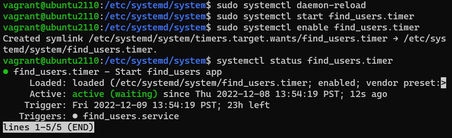

# ACIT 2420 Final Exam

## Part 1
`sudo apt update`
`sudo apt upgrade`

## Part 2
1. Enter `:%s/1/0/gci`
2. Then press "y", "n", "n", "n" in order to ignore other 1 rather than first 1
3. Enter insert mode with "i" and add h to eco
4. Enter `:%s/V/C/gci`
5. Then press "y", "y", "n" in order to ignore last occurrence in "Kelvin"
6. Enter `:%s/numbs/:digit:/gci`
7. Then press "y" to replace numbs to :digit:  
  

## Part 3
* To find print logs for the current boot, 
**/current** to find the matches  
  

* To find priority of warning,
**/warning** to find the matches  
  

* To find output in a nice pretty json,
**/json** to find the matches  
  

json-pretty is in -o option  
  

## Part 4
```
#!/bin/bash

USERNAME=$(grep -E 1[0-9]{3} /etc/passwd | awk -F: '{print $1} {print $3} {print $7}')

echo 'Regular users on the system are:' > /etc/motd

for user in $USERNAME; do
        echo "$user" >> /etc/motd
done

echo 'Users currently logged in are:' >> /etc/motd
echo $(whoami) >> /etc/motd
```

## Part 5
```
[Unit]
Description=start find_user program

[Service]
ExecStart=/home/vagrant/final/find_users

[Install]
WantedBy=multi-user.target
```

I put service file in **/etc/systemd/system**

output  


## Part 6
```
[Unit]
Description=Start find_users app

[Timer]
OnBootSec=1m
OnUnitActiveSec=1d

[Install]
WantedBy=timers.target
```

output  



